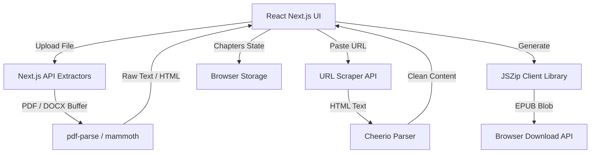

# EPUBify - Document to EPUB Converter

EPUBify is a full-stack Progressive Web App (PWA) built with Next.js 14 App Router, designed to easily convert standard documents, raw URLs, or markdown/text directly into a ready-to-use EPUB file natively on your device.

## Features
- **Drag & Drop Upload**: Supports batch conversions for PDF and DOCX files.
- **URL Scraper**: Instantly fetch article contents from public websites (strips ads & navigation).
- **Text & Markdown Input**: Directly write or paste content into chapters.
- **Client-Side Generation**: Privacy-focused EPUB builds directly in the browser using JSZip.
- **Live Preview & Reordering**: See your chapters and easily reorder them with drag-and-drop (`@dnd-kit`).
- **PWA Ready**: Works offline or as an installable app for mobile and desktop.
- **Automatic Caching**: Keeps your chapter setup safe in `localStorage` between reloads.

## Architecture

## Tech Stack
- Framework: Next.js 14 (App Router)
- Languages: TypeScript, HTML, CSS
- Layout/Design: Tailwind CSS, shadcn/ui, Lucide React
- Drag & Drop: `@dnd-kit`
- Conversions: `jszip` (Browser), `pdf-parse`, `mammoth`, `cheerio` (Server)
- PWA Support: `@ducanh2912/next-pwa`

## Local Development
1. Clone the repository
2. Run `npm install`
3. Run `npm run dev` to start the Next.js server on `http://localhost:3000`
